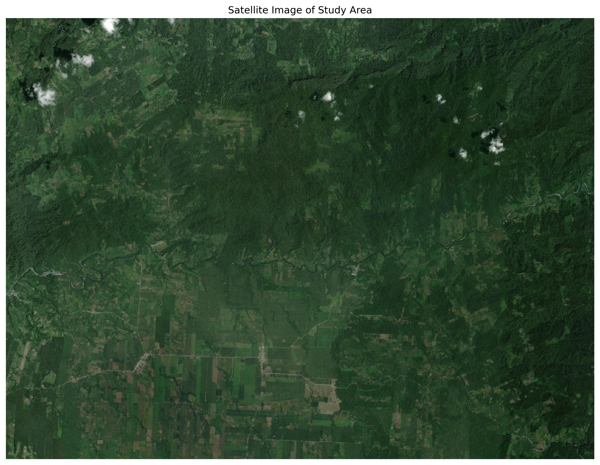
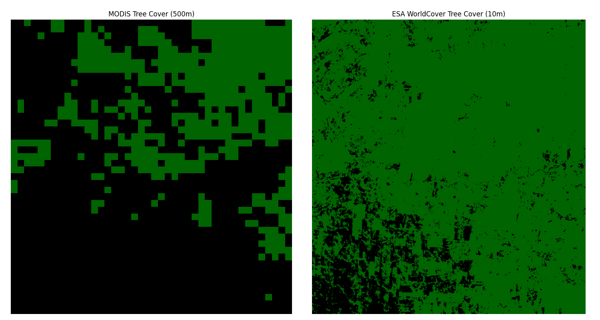

# Why Data Resolution Matters

This repository demonstrates how the **choice of spatial data resolution** can dramatically affect estimates of tree cover and subsequent ecological interpretations.  
Using two global land-cover datasets — **MODIS (500 m)** and **ESA WorldCover (10 m)** — this notebook walks through how to calculate, visualize, and compare forest extent for the same study area.

This project outputs two different calculations for tree cover.

  
*High-resolution basemap used for visual context.*

  
*Comparison of MODIS (500 m) and ESA WorldCover (10 m) forest-cover estimates.*

---

### Visual Comparison of Tree Cover Estimates

The area shown in the images covers approximately **370 km²**.  
A large portion of the **upper right** appears densely tree-covered, while the **lower left** contains noticeably less forest in the satellite image from World Imagery.  
This spatial pattern is reflected in both output maps, where **green** indicates tree cover and **black** represents all other land-cover types.

Placing the **MODIS** and **ESA WorldCover** products side by side makes the difference in resolution and classification readily apparent.  
The **MODIS** dataset estimates **105 km²** of tree cover (about **28%** of the total area), whereas the **ESA** dataset estimates **318 km²** (approximately **86%**).  
This contrast highlights how data resolution and classification methods can dramatically affect forest-cover estimates and their ecological interpretation.

---

## 🔍 Overview

The notebook performs three main tasks:

1. **Visualize the study site** — display a high-resolution reference image from Esri World Imagery.  
2. **Calculate forest area** using two datasets with different spatial resolutions.  
3. **Compare results** to illustrate how data resolution influences ecological conclusions.

This can be reproduced with your own area of interest and sampling sites.

---

## ⚙️ How to Run (Bring Your Own Data)

1. **Clone or download** this repository.
2. **Install dependencies:**
   ```bash
   pip install -r requirements.txt
